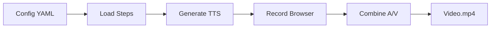

# Browser Video Recording

Record browser-driven demos with AI-generated voiceover. This feature automates browser interactions (navigation, clicks, scrolling) while generating synchronized narration in multiple languages.

## Overview

The `browser-video` command is designed for creating product demos, tutorials, and walkthroughs that showcase web applications. Unlike slide-based videos, browser videos capture live browser interactions with voiceover narration.



## Quick Start

### 1. Create a Config File

```yaml
# demo.yaml
metadata:
  title: "Product Demo"
  defaultLanguage: "en-US"

defaultVoice:
  provider: "elevenlabs"
  voiceId: "pNInz6obpgDQGcFmaJgB"  # Adam voice

segments:
  - id: "segment_000"
    type: "browser"
    browser:
      url: "https://example.com"
      steps:
        - action: "wait"
          duration: 1000
          voiceover:
            en-US: "Welcome to our product demo."
        - action: "click"
          selector: "#login-button"
          voiceover:
            en-US: "Click the login button to get started."
```

### 2. Set API Keys

```bash
export ELEVENLABS_API_KEY="your-key"
# or
export DEEPGRAM_API_KEY="your-key"
```

### 3. Generate Video

```bash
marp2video browser video --config demo.yaml --output demo.mp4
```

## Config File Format

The config file defines browser segments with steps and voiceovers.

### Full Schema

```yaml
metadata:
  title: "Demo Title"
  defaultLanguage: "en-US"

defaultVoice:
  provider: "elevenlabs"    # or "deepgram"
  voiceId: "voice-id"
  model: "eleven_multilingual_v2"  # ElevenLabs only

segments:
  - id: "segment_001"
    type: "browser"
    browser:
      url: "https://example.com"
      viewport:
        width: 1920
        height: 1080
      steps:
        - action: "wait"
          duration: 2000
          voiceover:
            en-US: "English narration"
            fr-FR: "Narration française"
            zh-Hans: "中文旁白"
        - action: "click"
          selector: "#button"
          voiceover:
            en-US: "Clicking the button"
        - action: "scroll"
          scrollY: 500
          voiceover:
            en-US: "Scrolling down"
        - action: "type"
          selector: "#input"
          text: "Hello world"
          voiceover:
            en-US: "Typing in the input field"
```

### Supported Actions

| Action | Parameters | Description |
|--------|------------|-------------|
| `wait` | `duration` (ms) | Wait for specified duration |
| `click` | `selector` | Click an element |
| `scroll` | `scrollX`, `scrollY` (pixels) | Scroll horizontally and/or vertically |
| `input` | `selector`, `value` | Type text into an element |
| `navigate` | `url` | Navigate to a URL |
| `screenshot` | - | Capture current state |
| `evaluate` | `script` | Execute JavaScript |
| `hover` | `selector` | Hover over an element |
| `keypress` | `key` | Send keyboard input |

#### Scroll Options

| Parameter | Values | Description |
|-----------|--------|-------------|
| `scrollX` | integer | Horizontal scroll amount (pixels) |
| `scrollY` | integer | Vertical scroll amount (pixels) |
| `scrollMode` | `relative` (default), `absolute` | Relative scrolls by delta; absolute scrolls to position |
| `scrollBehavior` | `auto` (default), `smooth` | Auto is instant; smooth animates the scroll |

## Multi-Language Support

Generate videos in multiple languages with a single command:

```bash
marp2video browser video --config demo.yaml --output demo.mp4 \
  --lang en-US,fr-FR,zh-Hans
```

### How It Works

1. **TTS Generation**: Audio is generated for each language
2. **Timing Calculation**: Per-voiceover durations are compared across languages
3. **Pace to Longest**: Each step uses the maximum duration (e.g., French is often longer than English)
4. **Video Recording**: Browser actions are timed to match the longest audio
5. **Audio Swap**: Additional language versions swap in different audio tracks

### Output Files

```
demo.mp4          # Primary language (first in --lang list)
demo_fr-FR.mp4    # French version (same video, different audio)
demo_zh-Hans.mp4  # Chinese version
```

## Audio Caching

Use `--audio-dir` to cache TTS audio and avoid repeated API calls:

```bash
marp2video browser video --config demo.yaml --output demo.mp4 \
  --audio-dir ./audio
```

### Cache Structure

```
audio/
├── en-US/
│   ├── segment_000.mp3      # Combined audio for segment
│   ├── segment_000.json     # Timing metadata
│   └── segment_000/
│       ├── voiceover_000.mp3  # Individual voiceover audio
│       ├── voiceover_001.mp3
│       └── ...
├── fr-FR/
│   └── ...
└── zh-Hans/
    └── ...
```

### How Caching Works

1. On first run, TTS audio is generated and saved to `--audio-dir`
2. A JSON metadata file stores per-voiceover timing information
3. On subsequent runs, existing audio is reused
4. If you modify voiceover text, delete the corresponding audio file to regenerate

## Subtitle Generation

Add subtitles to your videos:

```bash
# Simple subtitles from voiceover timing (no STT required)
marp2video browser video --config demo.yaml --output demo.mp4 \
  --subtitles

# Word-level subtitles using speech-to-text
marp2video browser video --config demo.yaml --output demo.mp4 \
  --subtitles-stt

# Burn subtitles into video (permanent, requires FFmpeg with libass)
marp2video browser video --config demo.yaml --output demo.mp4 \
  --subtitles --subtitles-burn

# Silent video with burned subtitles (no audio track)
marp2video browser video --config demo.yaml --output demo.mp4 \
  --subtitles --subtitles-burn --no-audio
```

!!! warning "FFmpeg libass Requirement"
    The `--subtitles-burn` flag requires FFmpeg compiled with libass support.
    See [Troubleshooting](#subtitle-burning-fails) for installation instructions.

### Subtitle Formats

| Format | Output | Use Case |
|--------|--------|----------|
| SRT | `demo.srt` | Most video players, YouTube |
| VTT | `demo.vtt` | Web browsers, HTML5 video |

### Subtitle Options Comparison

| Option | Method | Accuracy | API Cost |
|--------|--------|----------|----------|
| `--subtitles` | Voiceover timing | Sentence-level | None |
| `--subtitles-stt` | Speech-to-text | Word-level | Deepgram API |

## TTS Providers

### ElevenLabs (Default)

High-quality AI voices with emotional range.

```bash
marp2video browser video --config demo.yaml --output demo.mp4 \
  --provider elevenlabs \
  --voice pNInz6obpgDQGcFmaJgB
```

Popular voice IDs:

| Voice | ID |
|-------|-----|
| Adam | `pNInz6obpgDQGcFmaJgB` |
| Rachel | `21m00Tcm4TlvDq8ikWAM` |
| Domi | `AZnzlk1XvdvUeBnXmlld` |

### Deepgram

Fast and cost-effective TTS.

```bash
marp2video browser video --config demo.yaml --output demo.mp4 \
  --provider deepgram \
  --voice aura-asteria-en
```

## Advanced Usage

### Headless Mode

Run without displaying the browser (useful for CI/CD):

```bash
marp2video browser video --config demo.yaml --output demo.mp4 \
  --headless
```

### Custom Resolution

```bash
marp2video browser video --config demo.yaml --output demo.mp4 \
  --width 1280 --height 720 --fps 24
```

### Transitions Between Segments

```bash
marp2video browser video --config demo.yaml --output demo.mp4 \
  --transition 0.5  # 0.5 second crossfade
```

### Hardware-Accelerated Encoding

Use `--fast` for hardware-accelerated video encoding (VideoToolbox on macOS):

```bash
marp2video browser video --config demo.yaml --output demo.mp4 --fast
```

This significantly reduces encoding time for long videos.

### Testing and Debugging

When iterating on demos, use `--limit` and `--limit-steps` to test partial content:

```bash
# Test only the first 2 segments
marp2video browser video --config demo.yaml --output demo.mp4 --limit 2

# Test only the first 3 browser steps
marp2video browser video --config demo.yaml --output demo.mp4 --limit-steps 3

# Combine both for fastest iteration
marp2video browser video --config demo.yaml --output demo.mp4 \
  --limit 1 --limit-steps 3
```

This is useful for:

- Verifying subtitle timing
- Testing TTS voice settings
- Debugging browser automation steps

## Step Duration Guidelines

When manually setting `minDuration` for steps, use these guidelines:

| Content Type | Recommended Duration |
|--------------|---------------------|
| Short phrase (3-5 words) | 2000-3000ms |
| Medium sentence (8-12 words) | 3000-5000ms |
| Long sentence (15+ words) | 5000-8000ms |
| Complex explanation | 8000-12000ms |

**Rule of thumb**: ~150 words per minute = ~2.5 words per second

For a 10-word sentence:

- Base duration: 10 / 2.5 = 4 seconds = 4000ms
- Add 20% for French: 4800ms
- Add 500ms buffer: 5300ms

!!! tip "Let TTS Drive Timing"
    In most cases, you don't need to set `minDuration` manually. The tool automatically calculates timing from TTS audio duration and uses the longest language when generating multi-language videos.

## Troubleshooting

### Browser not opening

Ensure Chrome/Chromium is installed. The tool uses [Rod](https://github.com/go-rod/rod) for browser automation.

### Video timing mismatch

If video finishes before audio, check:

1. Each step has a `voiceover` with text
2. Audio files are being generated correctly
3. Try deleting cached audio and regenerating

### API errors

- Verify API keys are set correctly
- Check account has sufficient credits
- Ensure voice ID is valid for the provider

### Long TTS generation time

Use `--audio-dir` to cache audio:

```bash
# First run generates audio
marp2video browser video --config demo.yaml --output demo.mp4 \
  --audio-dir ./audio

# Subsequent runs reuse cached audio
marp2video browser video --config demo.yaml --output demo.mp4 \
  --audio-dir ./audio
```

### Subtitle burning fails

The `--subtitles-burn` flag requires FFmpeg compiled with libass support.

**Check if your FFmpeg has subtitle support:**

```bash
ffmpeg -filters 2>&1 | grep subtitles
```

If nothing is returned, install FFmpeg with libass:

=== "macOS"

    ```bash
    # Use homebrew-ffmpeg tap (includes libass by default)
    brew uninstall ffmpeg
    brew tap homebrew-ffmpeg/ffmpeg
    brew install homebrew-ffmpeg/ffmpeg/ffmpeg
    ```

=== "Linux (Ubuntu/Debian)"

    ```bash
    sudo apt install ffmpeg libass-dev
    ```

**Verify installation:**

```bash
ffmpeg -filters 2>&1 | grep subtitles
# Should show: subtitles V->V Render text subtitles...
```

**Alternative:** Use `--subtitles` without `--subtitles-burn` to generate a separate `.srt` file that video players can load.

### Subtitle text doesn't cycle properly

If subtitle text stays static for long periods, it may be a VFR (variable frame rate) issue. The tool automatically converts VFR to CFR (30fps) before burning subtitles. If you encounter issues:

1. Check that your FFmpeg version is up to date
2. Try regenerating the video with cached audio
3. Use `--limit-steps 5` to test a small portion first
