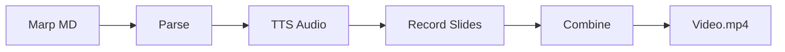

# marp2video

**Transform Marp Markdown Presentations into Videos with AI Voiceovers**

marp2video is a command-line tool that automates the conversion of [Marp](https://marp.app/) presentations into professional videos with AI-generated narration.

## Features

- :material-file-document: **Parse Marp presentations** with voiceover in HTML comments or JSON transcripts
- :material-microphone: **Text-to-speech** using ElevenLabs, Deepgram, and other providers via OmniVoice
- :material-web: **Browser automation** with Rod to display slides and record demos
- :material-video: **Screen recording** with synchronized audio using ffmpeg
- :material-earth: **Multi-language support** with BCP-47 locale codes (en-US, en-GB, fr-CA, etc.)
- :material-television: **Platform-optimized** output for YouTube, Udemy, Coursera
- :material-transition: **Crossfade transitions** between slides
- :material-subtitles: **Subtitle generation** from voiceover timing or speech-to-text
- :material-cached: **Audio caching** for faster iterations without re-incurring TTS costs

## Quick Example

=== "Marp Slides"

    ```bash
    # Simple: inline voiceover comments
    marp2video slides video --input slides.md --output video.mp4

    # Advanced: multi-language transcript
    marp2video slides video --input slides.md \
               --transcript transcript.json \
               --lang es-ES \
               --output video_spanish.mp4
    ```

=== "Browser Demo"

    ```bash
    # Record browser demo with voiceover
    marp2video browser video --config demo.yaml --output demo.mp4

    # Multi-language with audio caching
    marp2video browser video --config demo.yaml --output demo.mp4 \
               --audio-dir ./audio --lang en-US,fr-FR,zh-Hans

    # With subtitles burned in
    marp2video browser video --config demo.yaml --output demo.mp4 \
               --subtitles --subtitles-burn
    ```

## How It Works



1. **Parse** - Extract slides and voiceover from Marp markdown
2. **Generate Audio** - Convert text to speech via ElevenLabs/OmniVoice
3. **Render HTML** - Use Marp CLI to create HTML presentation
4. **Record** - Screen capture each slide with audio sync
5. **Combine** - Concatenate slides with optional transitions

## Getting Started

<div class="grid cards" markdown>

- :material-download: **[Installation](getting-started/installation.md)**

    Install marp2video and its dependencies

- :material-rocket-launch: **[Quick Start](getting-started/quick-start.md)**

    Create your first video in minutes

- :material-book-open-variant: **[User Guide](guide/pipeline.md)**

    Learn about the Marp slides pipeline

- :material-web: **[Browser Video](guide/browser-video.md)**

    Record browser demos with voiceover

- :material-code-json: **[Transcript Schema](reference/transcript-schema.md)**

    Multi-language JSON format reference

- :material-subtitles: **[Subtitles](guide/subtitles.md)**

    Generate SRT/VTT subtitles

</div>

## Use Cases

| Platform | Use Case | Command | Features |
|----------|----------|---------|----------|
| **YouTube** | Tutorials, demos | `slides video` | Combined video with transitions |
| **Udemy** | Course lectures | `slides video` | Individual slide videos |
| **Coursera** | Academic content | `slides video` | Professional voice settings |
| **Product Demos** | SaaS walkthroughs | `browser video` | Automated browser recording |
| **Documentation** | Animated guides | Both | Multi-language support |
